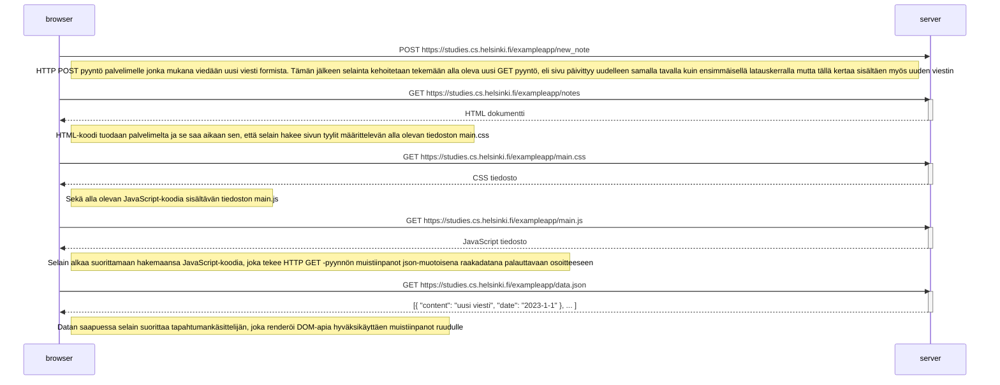

```mermaid
sequenceDiagram
    participant browser
    participant server
    
    browser->>server: POST https://studies.cs.helsinki.fi/exampleapp/new_note

    Note right of browser: HTTP POST pyyntö palvelimelle jonka mukana viedään uusi viesti formista. Tämän jälkeen selainta kehoitetaan tekemään alla oleva uusi GET pyyntö, eli sivu päivittyy uudelleen samalla tavalla kuin ensimmäisellä latauskerralla mutta tällä kertaa sisältäen myös uuden viestin

    browser->>server: GET https://studies.cs.helsinki.fi/exampleapp/notes
    activate server
    server-->>browser: HTML dokumentti
    deactivate server

    Note right of browser: HTML-koodi tuodaan palvelimelta ja se saa aikaan sen, että selain hakee sivun tyylit määrittelevän alla olevan tiedoston main.css
    
    browser->>server: GET https://studies.cs.helsinki.fi/exampleapp/main.css
    activate server
    server-->>browser: CSS tiedosto
    deactivate server

    Note right of browser: Sekä alla olevan JavaScript-koodia sisältävän tiedoston main.js
    
    browser->>server: GET https://studies.cs.helsinki.fi/exampleapp/main.js
    activate server
    server-->>browser: JavaScript tiedosto
    deactivate server
    
    Note right of browser: Selain alkaa suorittamaan hakemaansa JavaScript-koodia, joka tekee HTTP GET -pyynnön muistiinpanot json-muotoisena raakadatana palauttavaan osoitteeseen
    
    browser->>server: GET https://studies.cs.helsinki.fi/exampleapp/data.json
    activate server
    server-->>browser: [{ "content": "uusi viesti", "date": "2023-1-1" }, ... ]
    deactivate server    

    Note right of browser: Datan saapuessa selain suorittaa tapahtumankäsittelijän, joka renderöi DOM-apia hyväksikäyttäen muistiinpanot ruudulle
```