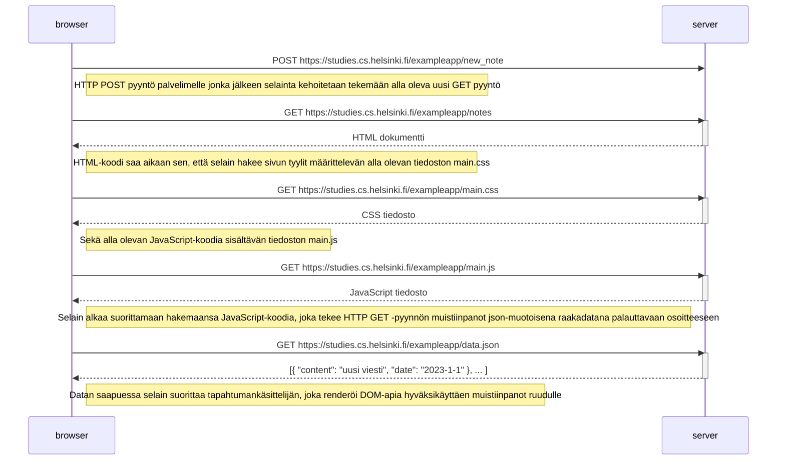

```mermaid
sequenceDiagram
    participant browser
    participant server
    
    browser->>server: POST https://studies.cs.helsinki.fi/exampleapp/new_note

    Note right of browser: HTTP POST pyyntö palvelimelle jonka jälkeen selainta kehoitetaan tekemään alla oleva uusi GET pyyntö

    browser->>server: GET https://studies.cs.helsinki.fi/exampleapp/notes
    activate server
    server-->>browser: HTML dokumentti
    deactivate server

    Note right of browser: HTML-koodi saa aikaan sen, että selain hakee sivun tyylit määrittelevän alla olevan tiedoston main.css
    
    browser->>server: GET https://studies.cs.helsinki.fi/exampleapp/main.css
    activate server
    server-->>browser: CSS tiedosto
    deactivate server

    Note right of browser: Sekä alla olevan JavaScript-koodia sisältävän tiedoston main.js
    
    browser->>server: GET https://studies.cs.helsinki.fi/exampleapp/main.js
    activate server
    server-->>browser: JavaScript tiedosto
    deactivate server
    
    Note right of browser: Selain alkaa suorittamaan hakemaansa JavaScript-koodia, joka tekee HTTP GET -pyynnön muistiinpanot json-muotoisena raakadatana palauttavaan osoitteeseen
    
    browser->>server: GET https://studies.cs.helsinki.fi/exampleapp/data.json
    activate server
    server-->>browser: [{ "content": "uusi viesti", "date": "2023-1-1" }, ... ]
    deactivate server    

    Note right of browser: Datan saapuessa selain suorittaa tapahtumankäsittelijän, joka renderöi DOM-apia hyväksikäyttäen muistiinpanot ruudulle
```