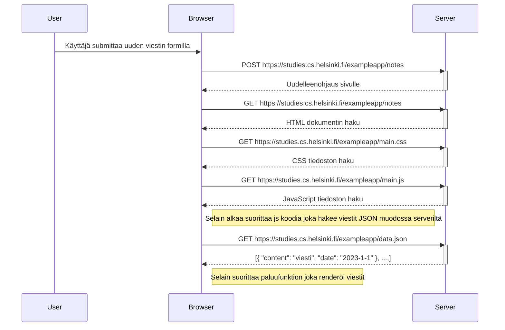

```mermaid
sequenceDiagram
User ->> Browser: Käyttäjä submittaa uuden viestin formilla
Browser ->> Server: POST https://studies.cs.helsinki.fi/exampleapp/notes
    activate Server
Server -->> Browser: Uudelleenohjaus sivulle
    deactivate Server
Browser ->> Server: GET https://studies.cs.helsinki.fi/exampleapp/notes
    activate Server
Server -->> Browser: HTML dokumentin haku
    deactivate Server
Browser ->> Server: GET https://studies.cs.helsinki.fi/exampleapp/main.css
    activate Server
Server -->> Browser: CSS tiedoston haku
    deactivate Server
Browser ->> Server: GET https://studies.cs.helsinki.fi/exampleapp/main.js
    activate Server
Server -->> Browser: JavaScript tiedoston haku
    deactivate Server

Note right of Browser: Selain alkaa suorittaa js koodia joka hakee viestit JSON muodossa serveriltä

Browser ->> Server: GET https://studies.cs.helsinki.fi/exampleapp/data.json
    activate Server
Server -->> Browser: [{ "content": "viesti", "date": "2023-1-1" }, ...,]
    deactivate Server
    
Note right of Browser: Selain suorittaa paluufunktion joka renderöi viestit
```