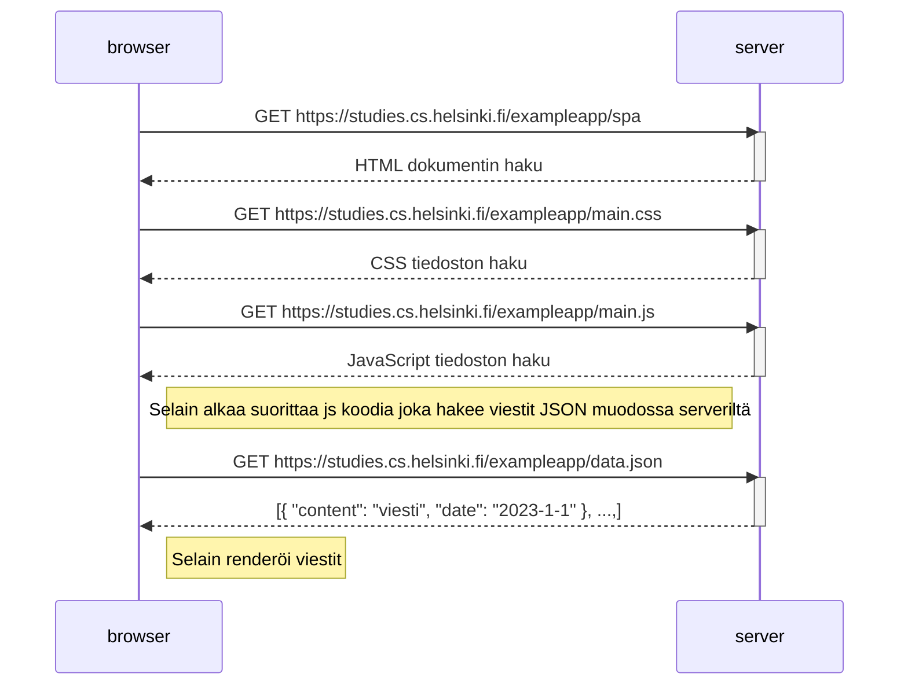

```mermaid
sequenceDiagram
browser->>server: GET https://studies.cs.helsinki.fi/exampleapp/spa
activate server
server-->>browser: HTML dokumentin haku
deactivate server

browser->>server: GET https://studies.cs.helsinki.fi/exampleapp/main.css
activate server
server-->>browser: CSS tiedoston haku
deactivate server

browser->>server: GET https://studies.cs.helsinki.fi/exampleapp/main.js
activate server
server-->>browser: JavaScript tiedoston haku
deactivate server

Note right of browser: Selain alkaa suorittaa js koodia joka hakee viestit JSON muodossa serveriltä

browser->>server: GET https://studies.cs.helsinki.fi/exampleapp/data.json
activate server
server-->>browser: [{ "content": "viesti", "date": "2023-1-1" }, ...,]
deactivate server

Note right of browser: Selain renderöi viestit
```
