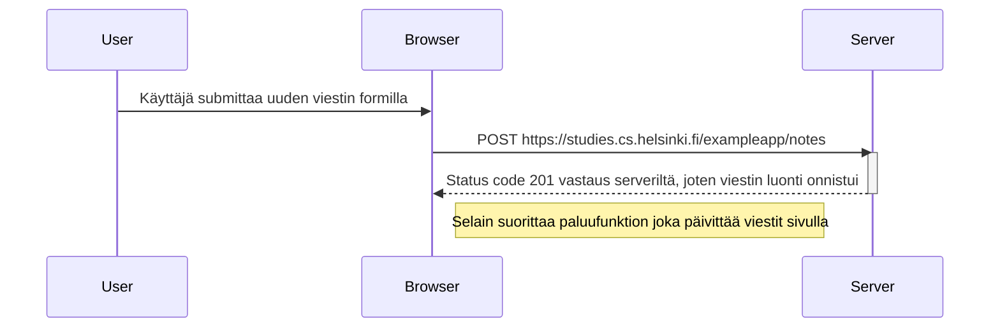

```mermaid
sequenceDiagram
User ->> Browser: Käyttäjä submittaa uuden viestin formilla
Browser ->> Server: POST https://studies.cs.helsinki.fi/exampleapp/notes
    activate Server
Server -->> Browser: Status code 201 vastaus serveriltä, joten viestin luonti onnistui
    deactivate Server
Note right of Browser: Selain suorittaa paluufunktion joka päivittää viestit sivulla
```
